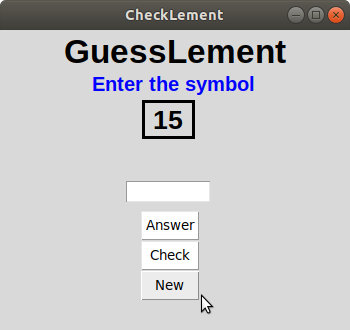
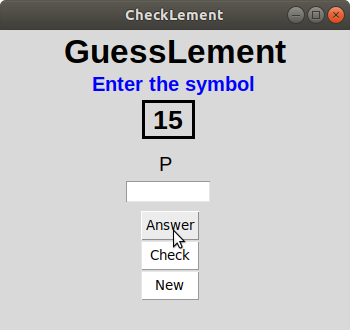
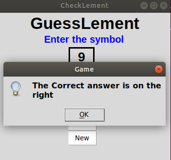
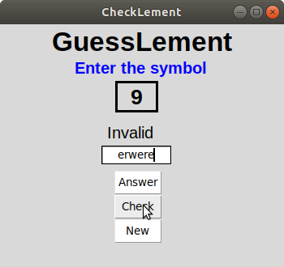
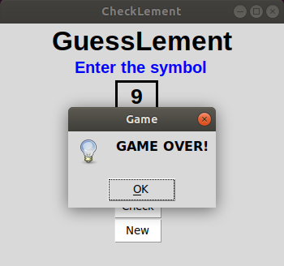
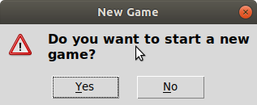

# Element guessing game in Python3 using Tkinter

## Requirements

To run this script, user needs to have Python3 and Tkinter library installed.

### Usage

Clone the GitHub repository using the following command :

```bash
$ git clone https://github.com/skr1p7/GuessLement.git
```

Navigate into the directory by using the following command :
```bash
$ cd GuessLement
```

To run the script, use the following command 

```bash
$ python3 code.py
```

## Sample images

### New Game



### Get answer



### Hints



### Invalid element



### More than 5 wrong inputs



### After game over choices

